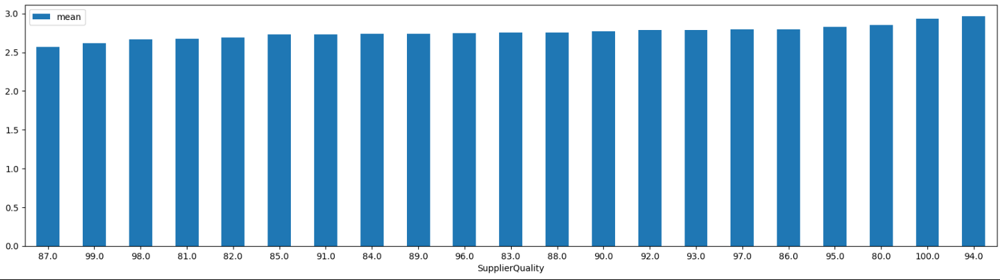
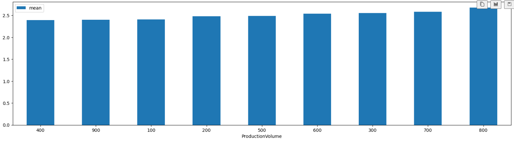
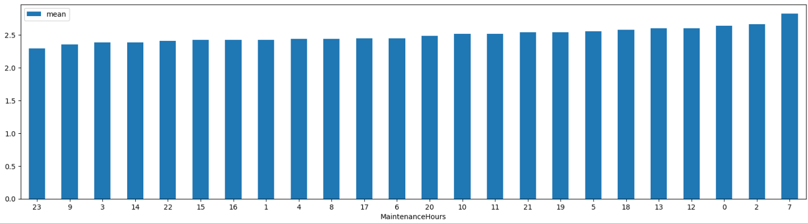
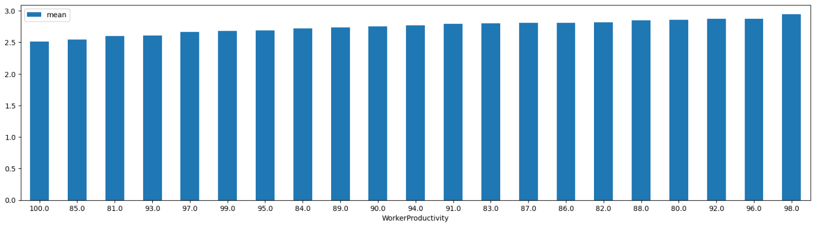
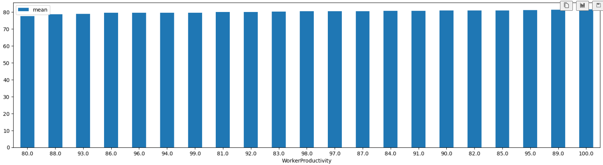
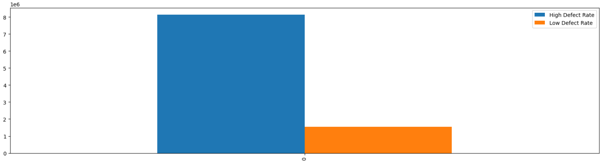
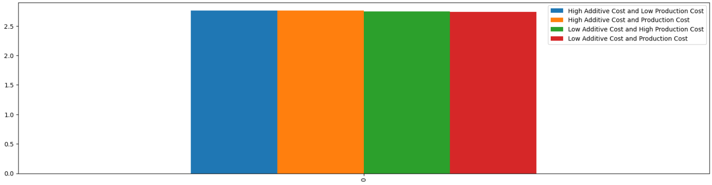

в результате разведовочного анализа данных были получены ответы на следующий список вопросов:

1. Каково влияние времени задержки поставок и качества поставщиков на уровень дефектов в производстве?
2. Как меняется процент простоев производства в зависимости от объема производства и количества часов на обслуживание?
3. Как уровень дефектов и оценка качества производства влияют на производительность рабочей силы?
4. Есть ли статистически значимая разница в потреблении энергии для производств с высоким и низким уровнем дефектов?
5. Как взаимодействуют затраты на аддитивное производство и стоимость основного производства для достижения минимального уровня дефектов?

1.1. в целом, средний уровень дефекто не сильно коррелирует с уровнем задержки, но при этом лучше всего себя показали дни от 0 до 2

1.2. тут уже уровень задержки гораздо сильнее коррелирует с уровнем дефектов, и, исходя из графика, в среднем, самый низкий уровень дефектов у поставщиков среднего качества (80%-90%)

2.1 процент простоев меняется не слишком сильно, но все же он меньше при меньших объемах произодства (за некоторым исключением)

2.2. в целом, процент простоев достигает минимальных значений при минимальном времени на обслуживание (опять же, за некоторым исключением)

3.1 в целом, чем меньше уровень дефектов, тем выше уровень продуктивности (и наоборот)

3.2 тут ситуация как и в вопросе выше, чем выше уровень качества производства, тем выше уровень производительности рабочей силы (и наоборот)

4 отталкиваясь от графика можно однозначно сказать, что разница есть и на производствах с меньшим уровнем дефектов энергии потребляют разительно меньше

5 в целом, в совокупности затраты на аддитивное производство и стоимость основного производства мало коррелируют с уровнем дефектов, но все же минимальный уровень дефектов достигается при минимальных затратах обеих состовляющих

